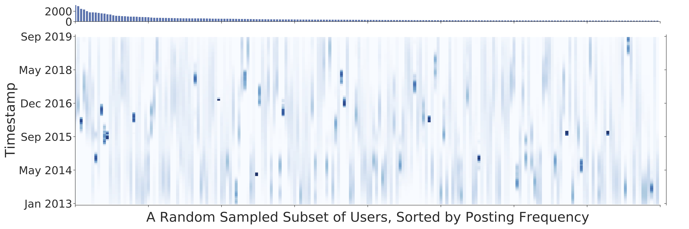

# Drinking from a Firehose: Continual Learning with Web-scale Natural Language
 [](https://opensource.org/licenses/MIT) 

This is the PyTorch implementation of the ConGraD method in our paper:

**Drinking from a Firehose: Continual Learning with Web-scale Natural Language**<br>
Hexiang Hu, Ozan Sener, Fei Sha, Vladlen Koltun<br>

[[arXiv](https://arxiv.org/abs/2007.09335)] [[GitHub](https://github.com/hexiang-hu/congrad)]

## Introduction

Continual learning systems will interact with humans, with each other, and with the physical world through time -- and continue to learn and adapt as they do. Such systems have typically been evaluated in artificial settings: for example, classifying randomly permuted images. A key limitation of these settings is the unnatural construct of discrete, sharply demarcated tasks that are solved in sequence. In this paper, we study a natural setting for continual learning on a massive scale. We introduce the problem of personalized online language learning (POLL), which involves fitting personalized language models to a population of users that evolves over time.  

## The Firehose Datasets

To facilitate research on POLL, we collect massive datasets of Twitter posts. These datasets, [Firehose10M and Firehose100M](https://github.com/hexiang-hu/firehose), comprise `100 million` tweets, posted by one million users over `six years`.



Above visualizes the user activity distribution of the Firehose dataset, which presents a highly heterogeneous and non-stationary user activity over time. We note that each data is associated with a a real-world timestamp that reflects a realistic and meaningful temporal dynamic of user's posts. The key statistics of these dataset are listed as the following:


| Datasets            | Num Users | Num Tweets | Num Tokens |
|:-------------------:|:---------:|:----------:|:----------:|
| Firehose10M 			  |   94.0K   |   10.4M    |   173.3M   |
| Firehose100M        |   917.4K  |   100.4M   |   1672.7M  |


## ConGraD: Continual Gradient Descent

The standard optimizer for CL is online gradient descent with a fixed number of gradient steps at each time step. The number of gradient steps per iteration is critical as it directly affects learning and generalization. An excessive number of gradient steps hurt generalization; whereas, an insufficient number of steps impair learning. We propose to adaptively control the number of gradient steps using an online validation buffer. The key idea is to use part of the online data to measure generalization and adapt the optimization accordingly. We present a simple strategy to keep this buffer without wasting any data. The resulting continual gradient descent method (ConGraD) significantly outperforms prior continual learning schemes on the [Firehose](https://github.com/hexiang-hu/firehose) datasets.


## Expriments

Here are two examples to run the experiments on Firehose10M using [MixedReplay](https://arxiv.org/abs/1902.10486) as CL method, and with OnlineGD and ConGraD as optimizers. Please refer to [data/README.md](https://github.com/hexiang-hu/congrad/blob/master/data/README.md) for details in preparing the data and downloading the pre-trained user-agnostic language model.

To run experiment with `MixedReplay + OnlineGD`, use the following command:

```Bash
bash scripts/train_f10m.sh 256 128 128 0 3 5 \
	--learner MixedReplay \
	--online_buffer_strategy greedy \
	--replay_buffer_strategy stratified \
	--init_weight data/pretrained_weights/stl.pretrained.pt
```

Here `256 128 128 0 3 5` represents `<online_data_chunk_size> <online_data_batch_size> <replay_data_batch_size> <validation_buffer_size> <replay_buffer_size> <maximum_num_of_gd_steps_per_online_chunk>`.

Similarly, to run the experiment of `MixedReplay + ConGraD`, use the following command:

```Bash
bash scripts/train_f10m.sh 256 128 128 1 3 5 \
 		--learner ConGraD_MixedReplay \
 		--online_buffer_strategy stratified \
 		--replay_buffer_strategy stratified \
 		--init_weight data/pretrained_weights/stl.pretrained.pt
```

## Usages

Please refer to the what follows for a complete view of all program arguments:

```bash
usage: train.py [-h] [--n_layer N_LAYER] [--n_head N_HEAD] [--d_head D_HEAD]
                [--d_embed D_EMBED] [--d_user_embed D_USER_EMBED]
                [--mtl_depth MTL_DEPTH] [--mtl_width MTL_WIDTH]
                [--d_model D_MODEL] [--d_inner D_INNER] [--dropout DROPOUT]
                [--dropatt DROPATT] [--init INIT] [--emb_init EMB_INIT]
                [--init_range INIT_RANGE] [--emb_init_range EMB_INIT_RANGE]
                [--init_std INIT_STD] [--proj_init_std PROJ_INIT_STD]
                [--optim {adam,sgd,adagrad}] [--lr LR] [--mom MOM]
                [--scheduler {cosine,inv_sqrt,dev_perf,constant}]
                [--warmup_step WARMUP_STEP] [--decay_rate DECAY_RATE]
                [--lr_min LR_MIN] [--clip CLIP] [--clip_nonemb]
                [--parsimonious] [--max_step MAX_STEP]
                [--batch_size BATCH_SIZE] [--eval_batch_size EVAL_BATCH_SIZE]
                [--eval_initial_model] [--batch_chunk BATCH_CHUNK]
                [--max_seqlen MAX_SEQLEN] [--not_tied] [--seed SEED] [--cuda]
                [--varlen] [--multi_gpu] [--log-interval LOG_INTERVAL]
                [--eval-interval EVAL_INTERVAL] [--work_dir WORK_DIR]
                [--model_class {MTLMemTransformerLM,MemTransformerLM}]
                [--clamp_len CLAMP_LEN] [--eta_min ETA_MIN]
                [--max_eval_steps MAX_EVAL_STEPS] [--break_ratio BREAK_RATIO]
                [--subword-augment]
                [--mtl-type {multi_encoder,multi_decoder,layerwise,all}]
                [--snapshot_dir SNAPSHOT_DIR] [--init_weights INIT_WEIGHTS]
                [--postfix POSTFIX] [--use_tb_logger] [--async_lr] [--debug]
                [--resume] [--resume_dir RESUME_DIR] [--eval_online_fit]
                [--dataset_path DATASET_PATH] [--dataset DATASET] [--cased]
                --vocab_file VOCAB_FILE
                [--online_batch_size ONLINE_BATCH_SIZE]
                [--online_per_user_rbsize ONLINE_PER_USER_RBSIZE]
                [--replay_batch_size REPLAY_BATCH_SIZE]
                [--replay_per_user_rbsize REPLAY_PER_USER_RBSIZE]
                [--online_buffer_strategy {greedy,reservoir,stratified,stratified-reservoir}]
                [--replay_buffer_strategy {greedy,reservoir,stratified,stratified-reservoir}]
                [--allow_zero_step] [--max_k_steps MAX_K_STEPS]
                [--learner {AGEM,OnlineOnly,ReplayOnly,MixedReplay,ConGraD_AGEM,ConGraD_OnlineOnly,
                	    ConGraD_ReplayOnly,ConGraD_MixedReplay}]
```

We note that many of the arguments that controls the model specifications are derived from [Transformer-XL](https://github.com/kimiyoung/transformer-xl). Here we list a selected set of key arguments and provide their explaination as the following:

```
key arguments:
  --batch_size BATCH_SIZE
                        the data chunk size. In continual learning, this is
                        the rate of data arrival at each model learning step;
                        In offline batch learning, this is the equivalent term
                        to the mini-batch size of the model.
  --eval_batch_size EVAL_BATCH_SIZE
                        evaluation batch size
  --eval_initial_model  whether or not to evaluate the initialized model
  --cuda                use CUDA
  --multi_gpu           use multiple GPU
  --work_dir WORK_DIR   experiment directory.
  --model_class {MTLMemTransformerLM,MemTransformerLM}
                        choose transformer model
  --mtl-type {multi_encoder,multi_decoder,layerwise,all}
                        types of multitask learning architecture (default: layerwise)
  --snapshot_dir SNAPSHOT_DIR
                        resume snapshot dir
  --init_weights INIT_WEIGHTS
                        weights to init
  --use_tb_logger       Turn on tensorboard logger.
  --async_lr            Smaller lr for backbone and larger lr for mtl.
  --eval_online_fit     Evaluate online loss as metric for online fit.
  --dataset_path DATASET_PATH
                        location of the data corpus
  --dataset DATASET     dataset name
  --cased               use cased or uncased corpus
  --vocab_file VOCAB_FILE
                        vocabulary
  --online_batch_size ONLINE_BATCH_SIZE
                        online batch size
  --online_per_user_rbsize ONLINE_PER_USER_RBSIZE
                        per user online memory buffer size
  --replay_batch_size REPLAY_BATCH_SIZE
                        replay batch size
  --replay_per_user_rbsize REPLAY_PER_USER_RBSIZE
                        per user replay memory buffer size
  --online_buffer_strategy {greedy,reservoir,stratified,stratified-reservoir}
                        online validation buffer strategy (default: greedy)
  --replay_buffer_strategy {greedy,reservoir,stratified,stratified-reservoir}
                        replay buffer strategy (default: greedy)
  --allow_zero_step     whether allow the minimum number of gradient steps to
                        be zero in ConGraD.
  --max_k_steps MAX_K_STEPS
                        the maximum number of gradient steps per online data
                        chunk.
  --learner {AGEM,OnlineOnly,ReplayOnly,MixedReplay,ConGraD_AGEM,ConGraD_OnlineOnly,
  	     ConGraD_ReplayOnly,ConGraD_MixedReplay}
                        type of online learning algorithms
```

## Citation

Please consider citing our work if you are using any content for the repository:
```
@article{hu2020drinking,
  title={Drinking from a Firehose: Continual Learning with Web-scale Natural Language},
  author={Hu, Hexiang and Sener, Ozan and Sha, Fei and Koltun, Vladlen},
  journal={arXiv preprint arXiv:2007.09335},
  year={2020}
}
```

## Acknowledgements

We thank the authors & contributors of the following repositories for making their code public:
* [Transformer-XL](https://github.com/kimiyoung/transformer-xl)
* [Gradient Episodic Memory](https://github.com/facebookresearch/GradientEpisodicMemory)
* [Average GEM](https://github.com/facebookresearch/agem)
* [Gradient-based Sample Selection](https://github.com/rahafaljundi/Gradient-based-Sample-Selection)
